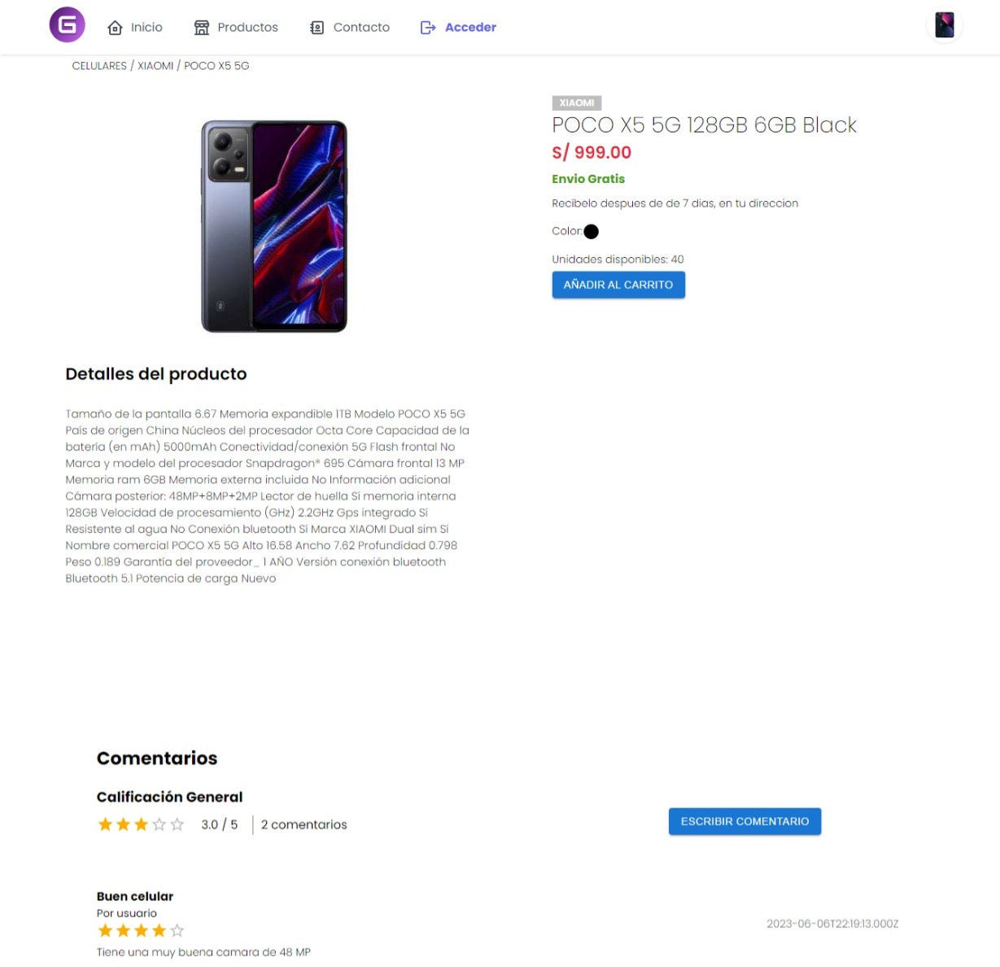

# Gamertec - FrontEnd

FrontEnd de tienda online Gamertec

## Previsualización

previsualización de `despliegue utilizando React`

- Pantalla Principal


- Pantalla de Productos


- Pantalla de Descripción de Producto
  

## Instalar Dependencias

para poder descargar las dependencias y la carpeta de node_modules, ejecutar el siguiente comando:

```bash
  npm install
```

## Configurar Variables de Entorno

### 1. Crear arhivo .env

Crear el arhivo .env en la raiz del proyecto, con las siguientes variables:

```js
//VARIABLE = "VALOR" // EJEMPLO
REACT_APP_API_URL = ""; // http://localhost:3001
```

`El puerto para este servicio FrontEnd, debe ser diferente al de la API`

### 2. Configurar variables de entorno

estas variables se tienen que configurar para que pueda cargar el proyecto, `tener en cuenta que para que REACT reconozca las variables estas deben empezar por: REACT_APP...`

| variable            | descripcion                             |
| :------------------ | :-------------------------------------- |
| `REACT_APP_API_URL` | `URL del despligue (dominio principal)` |

## Iniciar Proyecto

`Antes de iniciar el proyecto, incializar la api` para obtener los datos de la base.

Una vez desplegado el servicio de la API, ya podemos correr la FrontEnd en modo desarrollo, con el siguiente comando:

```bash
  npm run dev
```
